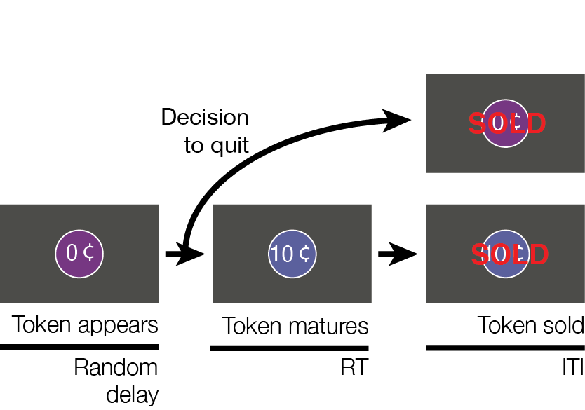
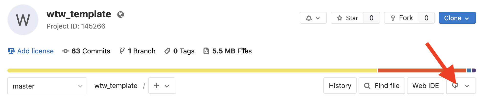
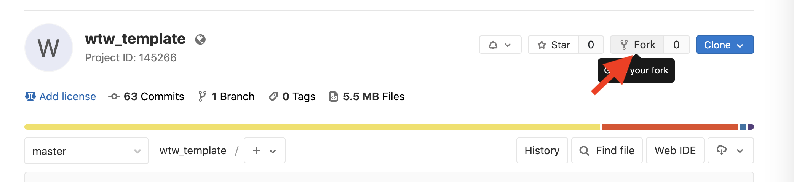
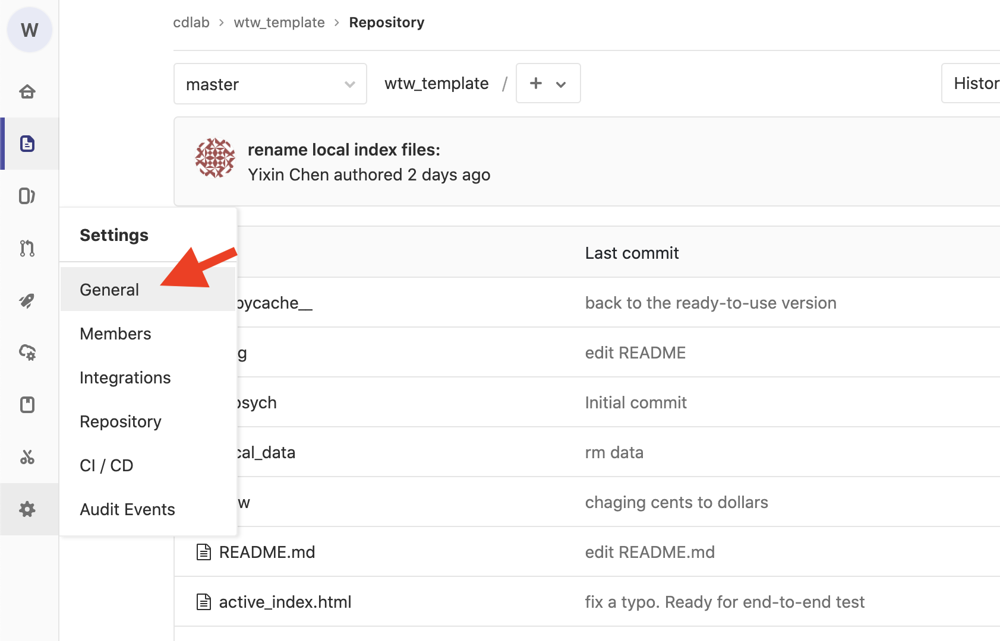
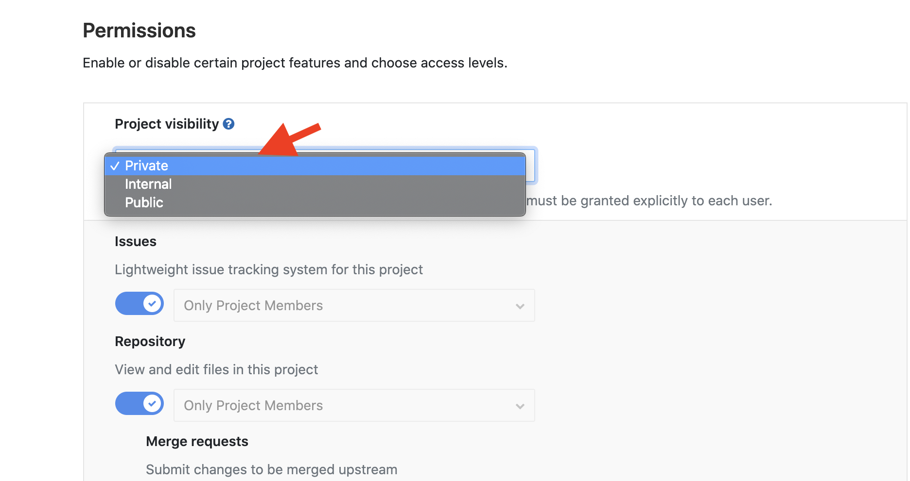

# An Experimentation Portal to Run the Willingness-to-wait Task

by Yixin Chen, 2021/06/17


## 1. Welcome
This repository contains the task code to run the willingness-to-wait (WTW) paradigm (McGuire and Kable, 2012 and 2015). You can use it to run either in-person or web-based experiments. You can modify the task scripts to control multiple aspects of your experiments (e.g., the total duration of a block, task condition in each block, and more). 


## 2. Introduction of the WTW task

**Feel free to skip this section if you are familiar with the WTW task.**

The WTW task is a computer-based paradigm to study adaptive calibration of persistence in uncertain environments(McGuire and Kable, 2012 and 2015, Fig.1). On each trial, a token appears on the screen and it will mature after a random delay. Participants could either wait for the token, or sell it anytime and initialize a new trial. Their goal is to maximize total rewards in a fixed period. 

There are two environments with different distributions of delay durations, in favor of either high persistence (**HP**) or limited persistence (**LP**). The central prediction of this paradigm is that decision makers can calibrate their persistence level in a context-appropriate manner, exhibiting higher persistence level in the HP environemnt compared to in the LP environment. 

The paradigm has three variants. In the **active-waiting** variant, participants continuously press a key to wait for a token and release the key to sell the token. In the **passive-waiting** variant, participants do nothing while waiting and press a key to sell the token. In the **rising-falling** variant, a trial either delivers a gain or loss.


<table align="center"><tr><td align="center" width="9999">



**Fig.1 Schematics of the WTW task**

</td></tr></table>


## 3. Repository content
The willingness-to-wait task is written in JavaScript with jsPsych (de Leeuw, 2015, https://www.jspsych.org/). 

#### 3.1 HTML files
The HTML files are homepages of different variants of the WTW task:

- <span style="color:IndianRed">active_index.html</span>: active-waiting web-based variant 

- <span style="color:IndianRed">passive_index.html</span>: passive-waiting web-based variant

- <span style="color:IndianRed">index.html</span>: rising-falling web-based variant

- <span style="color:IndianRed">local_active_index.html</span>: active-waiting in-person variant

- <span style="color:IndianRed">local_passive_index.html</span>: passive-waiting in-person variant

- <span style="color:IndianRed">local_index.html</span>: rising-falling in-person variant


#### 3.2 Data saving folders
In web-based experiments, a csv file is automatically saved under the folder <span style="color:IndianRed">data</span>. In in-person experiments, a csv file is saved under the browser's default downloads location, usually <span style="color:IndianRed">Downloads</span>. We recommend relocating the data to the folder <span style="color:IndianRed">local_data</span> to facilitate further processing. 

#### 3.3 Sub-function folders
The <span style="color:IndianRed">wtw</span> folder contains in-house sub-functions that build the task. The <span style="color:IndianRed">jspsych</span> folder is the jsPsych package downloaded from https://www.jspsych.org/. 

#### 3.4 Python scripts to convert data into a readable format
The generated csv file saves data in a jsPsych style, which is compact yet hard to read. We include two python scripts, <span style="color:IndianRed">parse_data.py</span> and <span style="color:IndianRed">parse_local_data.py</span>, to convert data into a more readable format. The usage is as follows: 

```shell
# for a csv file generated in web-based experiments
python parse_data.py original_csv_path destination_directory_path

# for a csv file generated in in-person experiments
python parse_local_data.py original_csv_path destination_directory_path
```

## 4. In-person WTW experiments 

#### 4.1 Setup
First, get a copy of this repository on your local PC. There are multiple ways to do so (see https://docs.github.com/en/get-started/quickstart/fork-a-repo for additional information). The simplest way is to go to the repository page (https://gitlab.pavlovia.org/cdlab/wtw_template) and click the download button.

<table align="center"><tr><td align="center" width="9999">

</td></tr></table>

You can alternatively get a synchronized copy using Git commands. Open your Terminal and enter: 

```bash
git clone https://gitlab.pavlovia.org/cdlab/wtw_template.git
```

In this case, if changes are made to this repo later, you can incorporate them use the following Git command: 

```bash
git pull origin master
```

Choose the in-person task variant you want to run, say the active-waiting variant. Open the corresponding homepage, <span style="color:IndianRed">local_active_index.html</span> in this case, in a browser to launch the experiment. The webpage will ask you to enter a participant ID. It is then followed by a tutorial session with four practice trials, and the real task.

By default, the task contains two 10-min blocks, the first one in the LP environment and the second one in the HP environment. The token is initially worth 0 cents and will be worth 2 cents after a random delay. In the HP environment, the delay is drawn from 8 possible values evenly spaced over 0-12 s. In the LP environment, the delay is drawn from 8 possible values logarithmically spaced over 0-24 s. **The delay sequence is preprogrammed 
into the script and therefore the same for every participant.**

#### 4.2 Data 
Once a participant completes the task, a csv file is automatically saved to the browser's default downloads folder, usually <span style="color:IndianRed">Downloads</span>. The file is named with the following format: *wtw_local-raw_participantID_date.csv*

The csv file saves the participant's choice data in the raw jsPsych format. Please relocate it to the <span style="color:IndianRed">local_data</span> folder and run the python script, <span style="color:IndianRed">parse_local_data.py</span>, to convert it to a readable format and save it at a destination folder of your choice:

```bash
python parse_local_data.py original_csv_path destination_directory
```

The eventual csv file includes the following variables:
- **trialIdx**: trial index
- **condition**: HP or LP
- **scheduledDelay**: how long a token is scheduled to mature, in s
- **scheduledReward**: the scheduled maturation value. Only for rising-falling variants.
- **RT**: reaction time to respond to a matured token, in s. NaN if the token is sold before it matrues
- **timeWaited**: how long the participant waits for a token, in s
- **trialEarnings**: trial-wise earnings in cents
- **totalEarnings**: accumulative earnings in cents
- **sellTime**: when a token is sold
- **trialStartTime**: when a trial *actually* starts and the delay starts to count down. In active-waiting variants, the trial actually starts after participants respond to a "Ready" signal 
- **trialReadyTime**: when the "Ready" signal appears, only for active-wating variants


## 5. Web-based WTW experiments 

#### 5.1 Setup 
We recommend deloying your web-based WTW experiments on Pavlovia(https://pavlovia.org/). To start, you need to fork this repo to your Pavlovia-affiliated Gitlab account. 

The simplest way to do so is to go to the repository page (https://gitlab.pavlovia.org/cdlab/wtw_template), click the fork button, and confirm to fork it under your namespace. If you want to sync your fork with the original repository, see https://docs.github.com/en/get-started/quickstart/fork-a-repo. 

<table align="center"><tr><td align="center" width="9999">

</td></tr></table>


Notice, you have to set your repo as **PRIVATE** to keep your data confidential. Go to Settings -> General, and then under Permissions, set Project visibility as "Private".

<table align="center"><tr><td align="center" width="9999">

</td></tr></table>

<table align="center"><tr><td align="center" width="9999">

</td></tr></table>

Choose the variant of web-based experiments you want to run. **Then change the name of the corresponding HTML file into "index.html".** This is because Pavlovia uses "index.html" as the homepage by default. 


#### 5.2 Pilot and run web-based experiments
On the Experiment page, you can set the status of your experiment as "inactive", "piloting", or "running". 


#### 5.3 Distribute the task URL 
Once the status is set as "running", Pavlovia will generate a URL for your task. You can send the task URL to participants via Email or through recruitment platforms (e.g., mTurk). If you plan to recruit on mTurk, we recommend creating a mTurk HIT through CloudResearch (https://www.cloudresearch.com/), since it provides several benefits, including being able to re-recruit participants in longitudinal studies and reducing mTurk fee by running participants in small batches. 

Whatever approach your choose, it is important to send each participant a unique task URL so that you can keep track of their identity. Most recruitment platforms will automatically add query string variables to the task URL, including <span style = "color: IndianRed ">workerId</span>, <span style = "color: IndianRed ">assignmentId</span> and <span style = "color: IndianRed ">hitId</span>. If you are distributing the task URL via Email, make sure you attach a <span style = "color: IndianRed ">workerId</span> query string variable. For example, if the original task link is https://run.pavlovia.org/your_username/your_task_name, you can attach <span style = "color: IndianRed ">workerId</span>, say <span style = "color: IndianRed ">S0001</span>, after a <span style = "color: IndianRed ">?</span> sign:https://run.pavlovia.org/your_username/your_task_name?workerId=S0001


#### 5.4 Buddle your task with Qualtric surveys
It is convenient to include a consent form and self-report measures in a Qualtric survey. To buddle a survey with your task, simply add the task URL to the end of the survey. You can use Qualtrics' Embedded-Data function (see https://www.qualtrics.com/support/survey-platform/survey-module/survey-flow/standard-elements/embedded-data/) to create participant-specific task URLs. 

#### 5.5 Payment
On most recruitment platforms, participants need to enter a secret key to redeem their payment. You can modify the HTML file to display the secret key at the end of the task. CloudResearch also enables you to generate a unique secret key for each participant (see cloudresearch.com/resources/blog/dynamic-secret-completion-codes-for-surveymonkey/) and pay a performance-based bonus (see https://www.cloudresearch.com/resources/blog/how-to-award-a-bonus-to-mturk-workers-using-turkprime/)

#### 5.6 Data 
Once a participant completes the task, a csv file is automatically saved to the Pavlovia Server, within the <span style="color:IndianRed">data</span> folder of the remote repo. You can download the file from the Experiment page on Pavlovia. Or you can pull from the Pavlovia Gitlab account. 

Run the python script, <span style="color:IndianRed">parse_data.py</span>, to convert the csv file to a readable format and save it at a destination folder of your choice:

```bash
python parse_data.py original_csv_path destination_directory
```

The eventual csv file includes the same variables as introduced in **4.2**. 


## 6. Customize the task 
This section might be helpful if you want to customize the task. Besides reading this section, we also highly recommend going over the two tutorials on the jsPsych website (https://www.jspsych.org/) to acquire basic syntax of JavaScript and jsPsych. 

As mentioned above, the homepage HTML file calls modules from the two folders, <span style="color:IndianRed">jsPsych</span> and <span style="color:IndianRed">wtw</span>, to build the task. Calling a module creates an instance of a certain event object (e.g., showing a piece of introduction text, lauching a practice trial, etc.). 

Here is one illustrative example. Say we want to present some instruction text, <span style="color:IndianRed">Hello</span> on the first page and <span style="color:IndianRed">World</span> on the second page. To do this, we will call the <span style="color:IndianRed">instructions</span> module, which is defined in the JavaScript file <span style="color:IndianRed">wtw/instructions.js</span>. 

We first source the module in the header section of the homepage. 

```javascript
<head>
    ...
    <script src="wtw/instructions.js"></script>
    ...
</head>
```
We then call the module in the body of the homepage as follows. The object looks like a Python dictionary. It creates an instance named <span style="color:IndianRed">instructions_hello_world</span> from the <span style="color:IndianRed">instructions</span> module. It presents <span style="color:IndianRed">Hello</span> on the first page and then <span style="color:IndianRed">World</span> on the second page. Participants can press <span style="color:IndianRed">j</span> and <span style="color:IndianRed">f</span> to navigate through pages. Since <span style="color:IndianRed">show_clickable_nav</span> is <span style="color:IndianRed">true</span>, participants can also navigate through pages using "Previous" and "Next" buttons. 
```javascript
<body>
    <script> 
        ...
        var instructions_hello_world = {
            type: "instructions",
            pages: ["Hello", "World"],
            key_forward: "j",
            key_backward: "f",
            show_clickable_nav: true }
        ...
    </script>
</body>
```

Say we want to add two active-waiting practice trials after showing <span style="color:IndianRed">Hello World</span>. For this purpose, we need to use another module <span style="color:IndianRed">wtw-active-prac</span>. Again, we first source the module in the header:

```javascript
<head>
    ...
    <script src="wtw/wtw-active-prac.js"></script>
    ...
</head>
```

Then in the script inside the body, we create two instances named <span style="color:IndianRed">practice_1</span> and <span style="color:IndianRed">practice_2</span> from the <span style="color:IndianRed">wtw-active-prac</span> module. We pass different <span style="color:IndianRed">trial_id</span> values to these two instances. In the first practice trial, <span style="color:IndianRed">instruction</span> takes the value <span style="color:IndianRed">"mature"</span> and participants are required to wait until the token matures. In the second practice trial, <span style="color:IndianRed">instruction</span> takes the value <span style="color:IndianRed">"immature"</span>, participants are required to sell the token before it matures. In both instances, the delay duration for a token to mature, <span style="color:IndianRed">scheduled_delay</span>, is <span style="color:IndianRed">5000</span> ms, the intertrial interval, <span style="color:IndianRed">iti</span> , is <span style="color:IndianRed">200</span> ms, and the maturation value, <span style="color:IndianRed">maturation_value</span>, is <span style="color:IndianRed">2</span> cents.

```javascript
<body>
    <script> 
        ...
    var practice_1 = {
      type: 'wtw-active-prac',
      scheduled_delay: 5000,
      trial_id: 'prac_1',
      maturation_value: 2,
      instruction: "mature",
      iti: 500
    }
    
    var practice_2 = {
      type: 'wtw-active-prac',
      scheduled_delay: 5000,
      trial_id: 'prac_2',
      maturation_value: 2,
      instruction: "immature",
      iti: 500
    }  
        ...
    </script>
</body>
```

Finally, we use the <span style = "color:IndianRed">jsPsych.init</span> command to define the order of these events. 
```javascript
<body>
    <script> 
        ...
    jsPsych.init({
      timeline: [instructions_hello_world, practice_1, practice_2]
    });
        ...
    </script>
</body>
```

So far we have covered all the basics. Please refer to the jsPsych website (https://www.jspsych.org/) for more useful information. To sum up, you can modify the task code in multiple ways. You can make changes to existing events, for example, changing <span style="color:IndianRed">maturation_value</span> to <span style="color:IndianRed">10</span> in the first practice trial, or changing <span style="color:IndianRed">type</span> of the first task block to <span style="color:IndianRed">"wtw-passive-block"</span> to run the passive-waiting variant instead. You can add new events to the experiment time line. Simply declare and define a new event and add it to the <span style="color:IndianRed">timeline</span> variable inside the <span style = "color:IndianRed">jsPsych.init</span> command. Similiarly, you also can delete or swap events. 


## 7. In-house module documentation
The <span style="color:IndianRed">wtw</span> folder contains the JavaScript files of the in-house modules: <span style="color:IndianRed">instructions</span>, <span style="color:IndianRed">wtw-active-prac</span>, <span style="color:IndianRed">wtw-passive-prac</span>, <span style="color:IndianRed">wtw-active-block</span>, and <span style="color:IndianRed">wtw-passive-block</span>. Below, we list the input parameters of each in-house module. The same information is also available in each module's JavaScript file. 

### 7.1 instructions

**Function**
- Display texts in pages.

**Inputs**
- **pages**: An array. Each element of the array is the content for a single page.
- **key_forward**: The key the subject can press in order to advance to the next page. The default value is 'rightarrow'.
- **key_backward**: The key that the subject can press to return to the previous page. The default value is 'leftarrow'. 
- **allow_backward**: If true, the subject can return to the previous page of the instructions. The default value is true. 
- **allow_keys**: If true, the subject can use keyboard keys to navigate the pages. The default value is true. 
- **show_clickable_nav**: If true, then a "Previous" and "Next" button will be displayed beneath the instructions. The default value is true. 
- **show_page_number**: If true, and clickable navigation is enabled, then Page x/y will be shown between the nav buttons. The default value is false.
- **button_label_previous**: The text that appears on the button to go backwards. The default value is "Previous".
- **button_label_next**: The text that appears on the button to go forwards. The default value is 'Next'. 

**Examples**
```javascript
<head>
    ...
    <script src="wtw/instructions.js"></script>
    <script src="wtw/instructions_text.js"></script> // source a js file that contains previously saved texts 
    ...
</head>
<body>
    <script>
        ...
        // display instructions 1a and 1b for an active-waiting experiment
        var example_instructions = {
            type: "instructions",
            pages: [active_instructions_1a_text, active_instructions_1b_text], 
            key_forward: "j",
            key_backward: "f",
            show_clickable_nav: true }
        ...
    </script>
</body>
```

### 7.2 wtw-active-prac / wtw-passive-prac

**Function**
- Lauch an active-waiting or passive-waiting practive trial 

**Inputs**
- **iti**: length of time (ms) between trials.  
- **feedback_time**: length of time (ms) to display the feedback. The default value is 1000. 
- **maturation_value**: the value of a matured token, in cents. 
- **trial_id**: the identifier of a trial. The default value is "prac".
- **scheduled_delay**: length of time (ms) for a token to mature. 
- **check_interval**: the length of the time interval to check the keypress (ms). The default value is 500.
- **instruction**: whether participants are required to sell the token after or before it matures. Either "mature" or "immature". 

**Examples**
```javascript
<head>
    ...
    <script src="wtw/wtw-passive-prac.js"></script> 
</head>
<body>
    <script>
        ...
        // launch an passive-wating practice trial which requires participants to wait until the token matures. 
        var example_practice_trial = {
            type: "wtw-active-wait",
            scheduled_delay: 5000,
            maturation_value: 2,
            instruction: "mature",
            iti: 500
}
        ...
    </script>
</body>
```

### 7.3 wtw-active-block / wtw-passive-block

**Function**
- Lauch an active-waiting or passive-waiting practive block

**Inputs**
- **iti**: length of time (ms) between trials. 
- **feedback_time**: length of time (ms) to display the feedback. The default value is 1000. 
- **maturation_value**: the value of a matured token, in cents.  
- **check_interval**: the length of the time interval to check the keypress (ms). The default value is 500.
- **condition**: "HP" or "LP". 
- **block_time**: length of time (ms) of a block. 
- **initialEarnings**: earnings earned from previous blocks, in cents. The default is 0. 

**Notes**

By default, the delay sequence in each environment is fixed and the same for each participant (specified by two variables, <span style="color:IndianRed">HPDelays</span> and <span style="color:IndianRed">LPDelays</span>, in  <span style="color:IndianRed">wtw/wtw-active-block.js</span> and <span style="color:IndianRed">wtw/wtw-passive-block.js</span>). You can change the sequence by editing the values of two variables. 

**Examples**
```javascript
<head>
    ...
    <script src="wtw/wtw-active-block.js"></script> 
</head>
<body>
    <script>
        ...
        // launch a 10-min LP active-waiting block and then a 10-min HP active-waiting block
        var wtw_LP_block = {
            type: "wtw-active-block",
            condition: "LP",
            block_time: 1000 * 60 * 10,
            maturation_value: 2,
            iti: 500
        }

        var wtw_HP_block = {
            type: "wtw-active-block",
            condition: "HP",
            block_time: 1000 * 60 * 10,
            maturation_value: 2,
            iti: 500,
            // use the total earnings from the first block as the initial earnings in the second block
            initialEarnings: function(){
              var earnObj = jsPsych.data.get().filter({trial_type: 'wtw-active-block'}).select('totalEarnings') 
              var earnings = earnObj.values[0]
              return(earnings[earnings.length - 1])
            }
        }
        ...
    </script>
</body>
```
